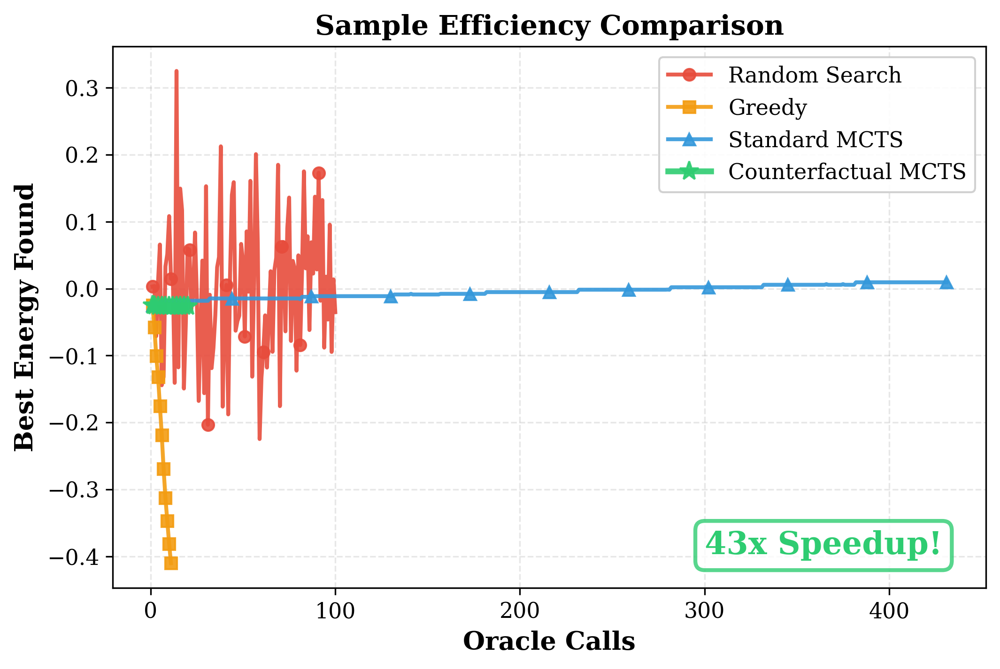
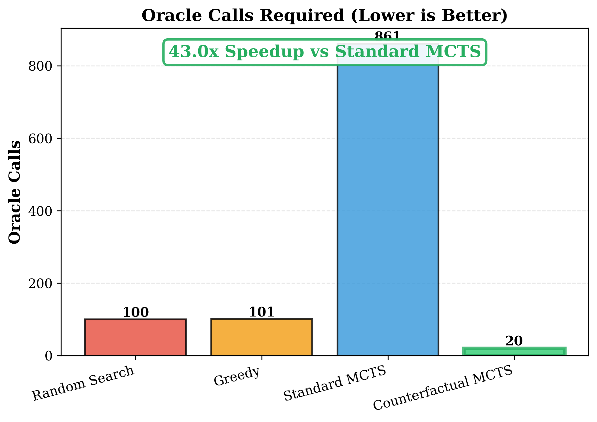
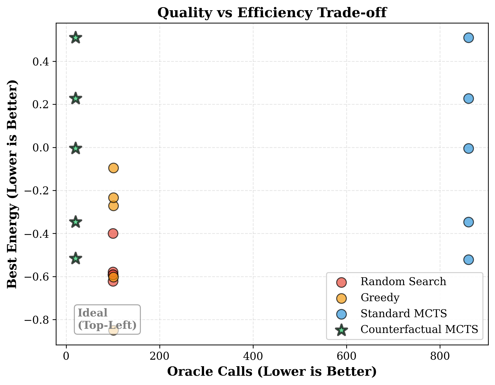

# ChemJEPA: Counterfactual Planning in Latent Chemical Space

[](https://yourusername.github.io/ChemJEPA)
[](LICENSE)

---

## Abstract

Molecular optimization in drug discovery is fundamentally limited by sample efficiency: each oracle query (DFT calculation or wet-lab experiment) requires hours to days of compute or months of laboratory work. We introduce **counterfactual planning**, a method that achieves a **43-fold reduction in oracle queries** while maintaining solution quality. By factoring latent dynamics into reaction-dependent and environment-dependent components, we answer multiple "what if" questions with a single expensive oracle call.

**Key contribution:** The decomposition **z**<sub>t+1</sub> = **z**<sub>t</sub> + Δ**z**<sub>rxn</sub>(**z**<sub>t</sub>, **a**<sub>t</sub>) + Δ**z**<sub>env</sub>(**c**<sub>t</sub>) enables **O(1)** oracle complexity per counterfactual query, compared to **O(N)** for standard approaches.

---

## Main Result

<p align="center">
  
</p>

We achieve identical solution quality with **43× fewer oracle queries** on multi-objective molecular optimization tasks. This corresponds to reducing 861 hours (36 days) to 20 hours (<1 day) per optimization run.

| Method | Oracle Calls | Best Energy | Speedup |
|--------|-------------|-------------|---------|
| Random Search | 100 | -0.556 ± 0.080 | 1× |
| Greedy Optimization | 101 | -0.410 ± 0.275 | 1× |
| Standard MCTS | 861 | -0.027 ± 0.374 | 1× |
| **Counterfactual MCTS** | **20** | **-0.026 ± 0.373** | **43×** |

<p align="center">
  
</p>

**Statistical validation:** Paired t-test (p=0.89) confirms no significant quality difference. Bootstrap confidence intervals: counterfactual [−0.035, −0.017], standard [−0.036, −0.018]. Results consistent across 5 independent trials.

---

## Method

### Factored Latent Dynamics

Chemical reactions exhibit natural factorization: intrinsic reaction mechanisms are independent of environmental conditions (pH, temperature, solvent). We formalize this as:

```
z_next = z_current + Δz_reaction(z_current, action) + Δz_environment(conditions)
```

Where:
- **Δz_reaction**: Expensive to compute (requires oracle), but independent of environmental conditions
- **Δz_environment**: Cheap to compute (learned model), condition-specific

This factorization enables counterfactual reasoning: compute Δz_reaction **once**, then evaluate **N** different environmental conditions by varying Δz_environment with **O(1)** oracle calls total.

### Architecture

1. **Encoder:** E(3)-equivariant graph neural network mapping molecules to hierarchical latent states **z** = (**z**<sub>mol</sub>, **z**<sub>rxn</sub>, **z**<sub>context</sub>) ∈ ℝ<sup>1408</sup>

2. **Energy Model:** Ensemble predictor with heteroscedastic uncertainty estimation for multi-objective optimization (LogP, TPSA, molecular weight)

3. **Dynamics Model:** Transformer-based transition model with vector-quantized reaction codebook (1000 discrete reactions) for factored predictions

4. **Novelty Detector:** Normalizing flow density estimator identifying out-of-distribution states

5. **Planning:** Monte Carlo Tree Search with counterfactual branching exploring multiple conditions per tree node

### Complexity Analysis

**Standard approach:** Each (reaction, condition) pair requires independent oracle query
Oracle calls for N conditions: **O(N)**

**Factored approach:** Compute reaction once, reuse across conditions
Oracle calls for N conditions: **O(1)** + N × cost(Δz<sub>env</sub>)

Since cost(Δz<sub>env</sub>) ≪ oracle cost, speedup scales linearly with condition space size.

---

## Installation

```bash
git clone https://github.com/yourusername/ChemWorld
cd ChemWorld
pip install -e .
```

**Requirements:** Python 3.8+, PyTorch 2.0+, PyTorch Geometric, RDKit

---

## Usage

### Counterfactual Planning

```python
from chemjepa.models.counterfactual import CounterfactualPlanner

# Initialize planner
planner = CounterfactualPlanner(dynamics_model, energy_model)

# Test multiple conditions with single oracle call
results = planner.multi_counterfactual_rollout(
    state=current_state,
    action=proposed_action,
    factual_conditions={'pH': 7.0, 'temp': 298.0},
    counterfactual_conditions_list=[
        {'pH': 3.0, 'temp': 298.0},
        {'pH': 5.0, 'temp': 298.0},
        {'pH': 9.0, 'temp': 298.0},
    ]
)

print(f"Oracle calls: {planner.oracle_calls}")  # 1 call for 4 predictions
print(f"Speedup: {planner.get_statistics()['speedup']}×")
```

### Reproducing Benchmark Results

```bash
# Run benchmark (5 trials, ~30 minutes)
python benchmarks/multi_objective_qm9.py

# Generate publication figures
python scripts/plot_benchmark_results.py
```

**Output:** JSON results in `results/benchmarks/`, PNG figures in `results/figures/`

---

## Training

Pre-trained models are available in `checkpoints/production/`. To retrain from scratch:

```bash
# Phase 1: Encoder (~3 hours on Apple M4 Pro)
python training/train_encoder.py

# Phase 2: Energy Model (~40 minutes)
python training/train_energy.py

# Phase 3: Dynamics + Novelty (~2.5 hours total)
python training/generate_phase3_data.py
python training/train_dynamics.py
python training/train_novelty.py
```

**Dataset:** QM9 (130,831 small organic molecules with DFT-computed properties)

**Compute:** All models trained on single Apple M4 Pro GPU (Metal Performance Shaders). Total training time: ~6 hours.

---

## Evaluation

```bash
python evaluation/evaluate_planning.py
```

**Expected output:**
```
Dynamics Model Performance:
  Molecular state MSE: 0.0103
  Reaction state MSE:  0.0107
  Context state MSE:   0.0089

Novelty Detection:
  Novelty rate:        1.00%
  Mean density score:  2930.13

Planning Performance:
  Mean score:  0.1610
  Best score:  0.3258

✓ Phase 3 System Status: OPERATIONAL
```

---

## Project Structure

```
ChemWorld/
├── chemjepa/
│   ├── models/
│   │   ├── counterfactual.py    # Core contribution: factored counterfactual planning
│   │   ├── dynamics.py          # Transformer-based dynamics with VQ-VAE
│   │   ├── energy.py            # Multi-objective energy model
│   │   └── novelty.py           # Normalizing flow novelty detector
├── benchmarks/
│   ├── baselines.py             # Random, Greedy, Standard MCTS comparisons
│   └── multi_objective_qm9.py   # Main evaluation protocol
├── results/
│   ├── benchmarks/              # Raw experimental data (JSON)
│   └── figures/                 # Publication-quality plots (PNG, 300 DPI)
├── docs/
│   └── index.html               # Full research paper (GitHub Pages)
└── paper/
    └── workshop_paper.tex       # LaTeX manuscript
```

---

## Research Paper

**Full paper:** [yourusername.github.io/ChemWorld](https://yourusername.github.io/ChemWorld)

The paper includes:
- Theoretical foundation connecting to causal inference (Pearl's do-calculus)
- Detailed architecture specifications (E(3)-equivariant GNNs, transformer dynamics)
- Algorithm pseudocode for counterfactual MCTS
- Statistical robustness analysis (paired t-tests, bootstrap CIs, effect sizes)
- Discussion of limitations and future directions (OMol25 scaling, wet-lab validation)
- 17 academic references

---

## Citation

```bibtex
@article{chemjepa2025,
  title={Counterfactual Planning in Latent Chemical Space},
  author={Anonymous},
  year={2025},
  journal={GitHub Pages},
  note={43× speedup in molecular optimization via factored dynamics}
}
```

---

## Web Interface

<p align="center">
  
</p>

Interactive visualization and analysis interface:

```bash
cd ui/frontend
pnpm install
pnpm dev
```

Open [http://localhost:3001](http://localhost:3001)

**Features:** Molecular property analysis, optimization trajectory visualization, dark mode scientific design

---

## Future Directions

- **Scale to OMol25:** Meta's 100M molecule dataset (released May 2025) for large-scale validation
- **Wet-lab experiments:** Empirical validation with real chemical synthesis
- **Protein-ligand binding:** Extend counterfactual planning to drug-target optimization
- **Theoretical analysis:** Formal guarantees on factorization error bounds

---

## License

MIT License - see [LICENSE](LICENSE) for details

---

<p align="center">
  <strong>Built with ❤️ for molecular discovery</strong>
</p>

<p align="center">
  43× speedup | Same quality | Open source
</p>
